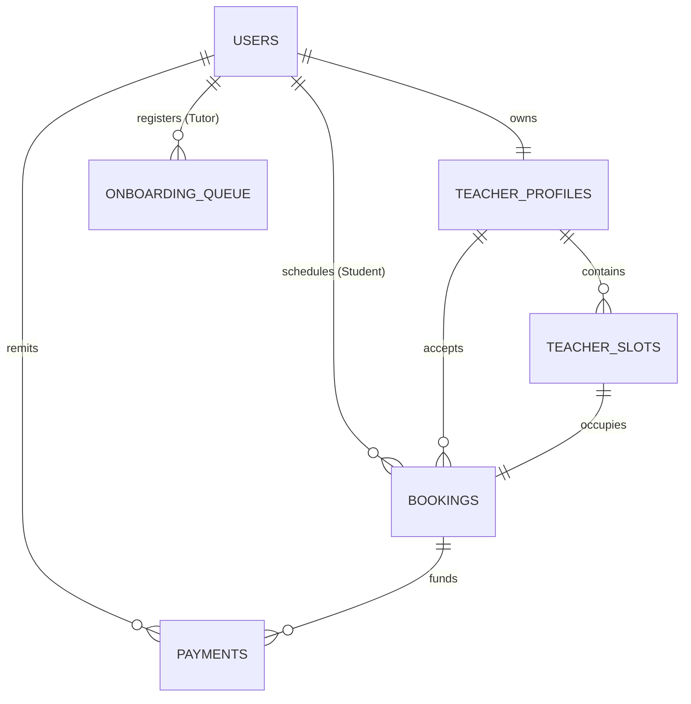

# ZERA EDU — High Performance Node.js Backend API

Production-ready backend microservice built with **Node.js, Express, and MySQL**. Manages identity authentication, availability slot management, transactional booking allocations, and financial logging for the ZERA EDU Academic Infrastructure Platform.

---

## Technical Stack & Architecture

- **Core Framework**: Express.js (v4.19)
- **Database Engine**: MySQL 8 (via `mysql2/promise` connection pool)
- **Security Mechanisms**: Dual-Token JWT Auth (Access + Sliding Refresh), bcryptjs password hashing (12 rounds)
- **Middlewares**: Helmet security headers, compression, CORS filtering, rate limiting (Express Rate Limit), validation (Express Validator)
- **Structured Logging**: Winston + Morgan logger engines
- **Test Suite**: Jest + Supertest (query mocking environment)

---

## Project Structure

```
backend/
├── src/
│   ├── app.js               # Express application bootstrap
│   ├── config/
│   │   └── db.js            # MySQL database connection pool & schema migrations
│   ├── middleware/
│   │   ├── authenticate.js  # JWT verification gateway
│   │   ├── authorize.js     # Access controls based on roles
│   │   ├── rateLimiter.js   # Bruteforce security bounds
│   │   └── errorHandler.js  # Global exception masking and mapping
│   ├── routes/
│   │   ├── auth.js          # Credentials lifecycle & details updates
│   │   ├── teachers.js      # Directory search & profile filters
│   │   ├── slots.js         # Availability configuration
│   │   ├── bookings.js      # Transactional slot bookings
│   │   ├── enquiries.js     # Callback registrations and contact logs
│   │   └── payments.js      # Auditing transaction ledgers
│   └── utils/
│       ├── AppError.js      # Operational exception class
│       └── logger.js        # Logging setup
```

---

## Database Schema (Relational Blueprint)



1. **`users`**: Contains authentication records (hashed passwords), registration states, and roles (`student`, `teacher`, `admin`).
2. **`teacher_profiles`**: Holds qualifications, pricing quotes, search indexes, and evolutionary maps metrics.
3. **`teacher_slots`**: Captures time frames of availability which lock transactionally upon booking allocations.
4. **`bookings`**: Transactional registry linking students to tutors.
5. **`enquiries`**: Data-capture collection for callback requests and messaging logs.
6. **`payments`**: Platform audit ledgers holding Razorpay transaction references.
7. **`onboarding_queue`**: Administrative pipeline for new tutor registrations.

---

## Deployment & Setup Guide

### Local Development Setup
1. Configure database parameters inside `.env`.
2. Install npm dependencies:
   ```bash
   npm install
   ```
3. Boot development live server (Nodemon):
   ```bash
   npm run dev
   ```

### Running with Docker Compose
Orchestrate the app and database instantly in production container builds:
```bash
docker-compose up --build -d
```

### Process Management via PM2
Run the cluster environment across all CPU cores:
```bash
npm install -g pm2
pm2 start ecosystem.config.js --env production
```

---

## API Documentation Core Endpoints

### 🔐 Authentication (`/api/auth`)
* `POST /register` — Register student or teacher user accounts.
* `POST /login` — Validates credentials and returns JWT payload.
* `POST /refresh` — Swaps refresh tokens for new session signatures.
* `GET /me` — Retrieves session holder details.

### 🎓 Teachers & Slots (`/api/teachers`, `/api/slots`)
* `GET /teachers` — Directory search utilizing query filters (board, standard, cost, timing, location).
* `POST /slots` — Add slots (Teacher role).
* `DELETE /slots/:id` — PURGES slot availability (Teacher role).

### 📅 Bookings & Override (`/api/bookings`)
* `POST /bookings` — Create a slot booking transactionally.
* `GET /bookings` — Dynamic scoping of scheduled sessions.
* `PUT /bookings/:id/status` — Mark complete or cancel.
* `PUT /bookings/:id/swap` — Hot-swap the tutor assignment.

### 📊 Admin Operations (`/api/admin`)
* `GET /dashboard` — Total billings, retention cuts, and queue numbers.
* `PUT /onboarding/:id` — Approves/rejects new tutor submissions.
