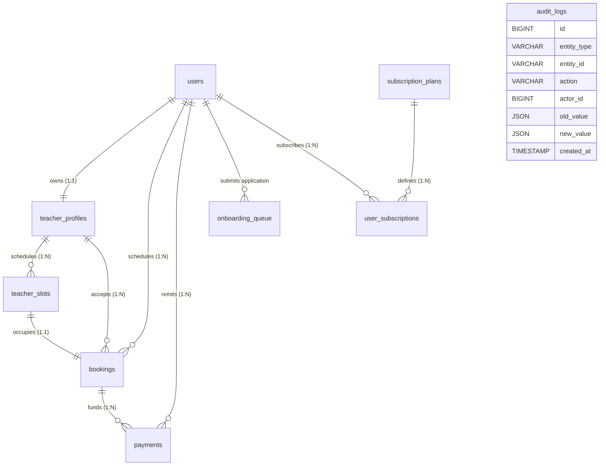

# ZERA EDU — Enterprise Academic Infrastructure Platform

ZERA EDU is a production-ready, high-performance web platform designed to streamline student-tutor matching, class scheduling, attendance tracking, and administrative workflows. 

This repository contains two main modules:
*   **`/backend`**: A secure REST API built with Node.js, Express, and MySQL.
*   **`/frontend`**: A responsive, premium client application built with HTML5, CSS3 (Vanilla), and custom Javascript logic.

---

## 🏗️ Technical Architecture & Key Features

### 1. Hybrid ID Mapping Strategy
To achieve maximum indexing efficiency and ensure database privacy, the system utilizes a **Hybrid Key Setup**:
*   **Internal Keys (`BIGINT AUTO_INCREMENT`)**: Used exclusively inside database tables and foreign keys to ensure fast joins and clustered indexing performance.
*   **External Keys (`CHAR(26)` ULID)**: Uses time-sortable, Crockford Base32 Universally Unique Lexicographical Identifiers (ULIDs) generated on the server. Exposed in all REST payloads, URLs, and frontend views to prevent enumeration attacks.

### 2. Optimistic Concurrency Locking
To prevent double-booking slot conflicts under heavy concurrent requests, the booking process uses **Optimistic Locking** on `teacher_slots`:
```sql
UPDATE teacher_slots SET is_booked = 1, version = version + 1 
WHERE id = ? AND version = ? AND is_booked = 0;
```
If two students attempt to book the same slot simultaneously, the transaction that completes second will affect `0` rows and immediately throw a `409 Conflict` error to retry safely.

### 3. Cascading Soft Deletes & Universal Auditing
*   **Soft Deletes**: Deletions (such as removing slots or deactivating accounts) set `deleted_at = CURRENT_TIMESTAMP` and record `deleted_by`. Active queries filter on `deleted_at IS NULL` to safeguard historical data.
*   **Change Audit Trails (`audit_logs`)**: Model modifications (creates, edits, status switches) are tracked in the database with timestamps, actors, action flags, and JSON payloads showing old vs. new values.

### 4. Admin Feature Set
*   **Direct Tutor Provisioning**: Admin can add verified teachers directly. The backend automatically inserts the user, generates their verified profile, and registers a pre-approved onboarding queue entry in a single database transaction.
*   **Cascading Removal**: Admin can delete teachers. The backend executes a cascading soft-delete across users, profiles, and slots records.
*   **Sorting & Display Prioritization**: Admin can configure a display ranking weight (`display_order`) for each teacher in the User Registry. The public search query sorts by `display_order DESC` first, letting admins choose who to showcase on top.

---

## 📂 Project Directory Mapping

```
Vidyaaniketan2/
├── backend/
│   ├── src/
│   │   ├── app.js               # Express server configuration
│   │   ├── config/
│   │   │   └── db.js            # MySQL connection pool & seeding migrations
│   │   ├── middleware/
│   │   │   ├── authenticate.js  # JWT validation & context appending
│   │   │   ├── authorize.js     # Role-based request blockers
│   │   │   ├── rateLimiter.js   # Rate limit protection
│   │   │   └── errorHandler.js  # Global error interceptor
│   │   ├── routes/
│   │   │   ├── admin.js         # User registry edits, priority ranks & onboarding
│   │   │   ├── attendance.js    # OTP-verified attendance records
│   │   │   ├── auth.js          # Authentication endpoints
│   │   │   ├── bookings.js      # Optimistic locking slot bookings
│   │   │   ├── enquiries.js     # Public callback forms
│   │   │   ├── payments.js      # Transaction audits list
│   │   │   ├── slots.js         # Teacher slot management
│   │   │   └── teachers.js      # Public/student search filters
│   │   └── utils/
│   │       ├── auditLogger.js   # Structured audit tracking
│   │       ├── ulid.js          # Crockford Base32 generator
│   │       └── logger.js        # Winston + Morgan logging setup
│   ├── package.json             # Backend script metadata
│   └── Dockerfile               # Container builder
├── frontend/
│   ├── app.html                 # Main SPA application wrapper
│   ├── index.html               # Public marketing landing page
│   ├── js/
│   │   ├── api.js               # Central api fetch wrapper with token refresh
│   │   ├── app.js               # SPA view rendering and state management
│   │   └── landing.js           # Public directory filters & callback submissions
│   └── logo.png                 # Brand image asset
```

---

## 📊 Relational Database blueprint



---

## 🚀 Setup & Launch Procedures

### Prerequisites
*   **Node.js** (v18+ recommended)
*   **MySQL Server** (v8.0+)
*   **Web Browser / HTTP Client**

### 1. Database Configuration
Create a database named `zera_edu` (or custom name) in MySQL, and create a `.env` file inside the `backend/` folder based on `.env.example`:
```env
PORT=5000
DB_HOST=127.0.0.1
DB_PORT=3306
DB_USER=your_mysql_username
DB_PASSWORD=your_mysql_password
DB_NAME=zera_edu
JWT_SECRET=your_jwt_access_signature_secret_key
JWT_REFRESH_SECRET=your_jwt_refresh_signature_secret_key
```

### 2. Run Backend API Server
```bash
cd backend
npm install
npm run dev # Starts development server with nodemon
```
*Note: The server will automatically bootstrap, initialize schemas, and seed demo accounts upon start.*

### 3. Run Frontend Interface
You can serve the `frontend/` folder using a static file server or extensions like VS Code's "Live Server" on port `5500`.
*   Public Landing Page: `http://localhost:5500/index.html`
*   Authenticated SPA: `http://localhost:5500/app.html`

### 4. Running Backend Test Suites
```bash
cd backend
npm test
```

---

## ✨ Future Premium Features Proposals

To elevate ZERA EDU into a state-of-the-art SaaS academic platform, the following features are recommended for future implementation:

1. **WebRTC Peer-to-Peer Virtual Classrooms**
   *   **Concept**: Integrate a face-to-face browser virtual classroom inside the application interface.
   *   **Tech Stack**: WebRTC, Socket.io for signaling, and a canvas blackboard component.
   *   **Benefit**: Users can conduct live tutoring sessions directly inside ZERA EDU without relying on Zoom or Google Meet.

2. **Automated Smart-Matching AI Recommendations**
   *   **Concept**: Use basic machine learning vectors (or LLM connectors) to automatically recommend the top 3 teachers to a student.
   *   **Metrics**: Filter based on the student's board, preferred standards, target subject, locality range, slot overlap availability, and parent budget.

3. **Analytics Dashboard Widgets with Chart.js**
   *   **Concept**: Display graphical metrics reporting student progress, average weekly attendance scores, and billing/earnings indicators.
   *   **Benefit**: Students can visualize learning progression, and teachers/admins can track revenues and booking patterns.

4. **Multi-Lingual Localization Engine**
   *   **Concept**: Provide a dynamic layout translator toggling the application interface between English, Hindi, and regional languages.
   *   **Benefit**: Expands accessibility to non-English speaking households and regional board students.

5. **Automated Notification Gateway (Email & SMS)**
   *   **Concept**: Integrate Twilio SMS and SendGrid email vectors.
   *   **Triggers**: Send real-time alerts when a booking is confirmed, cancelled, a slot changes, or when attendance OTPs are generated.
